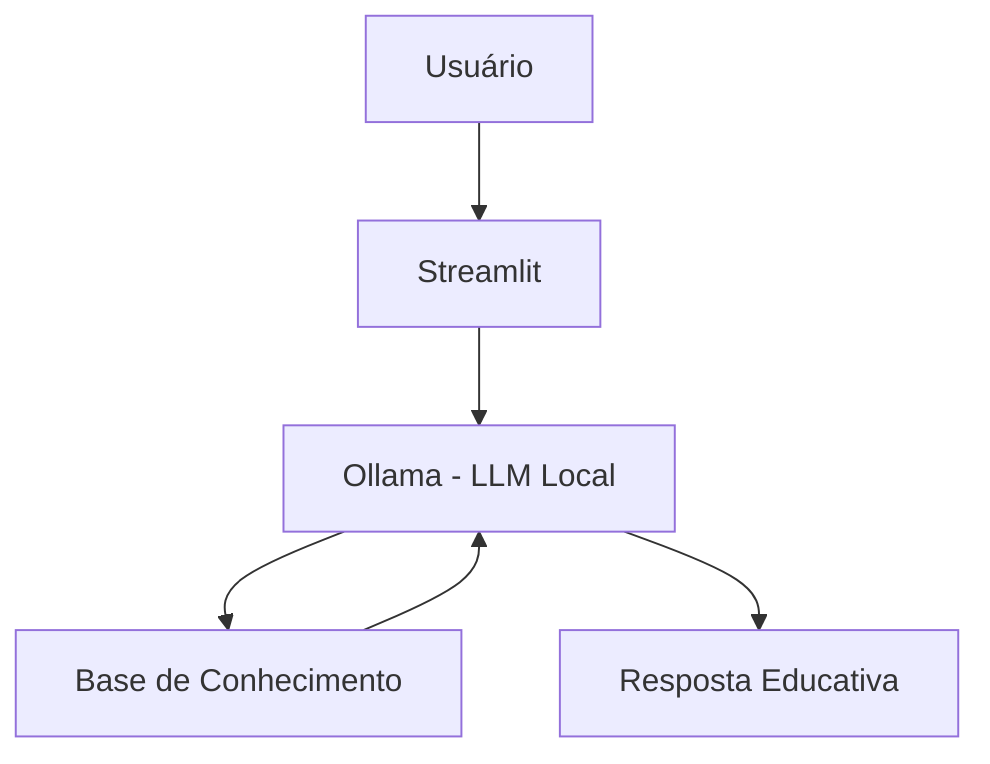

# 🎓 Junior - Controlador de Inventário Inteligente

> Agente de IA Generativa quea ajudar no entendimento de como funcionar um  controle de estoque para loja de pequeno porte.

## 💡 O Que é o Junior?
Junior analisar os arquivo base e mostrar alguns indicadores de como está o estoque quais produtos estão vendendo muito e dá dicas d3e melhoria na gestão do inventário

**O que o Junjior faz:**
- ✅ Retorna algums indicadores
- ✅ Usa dados do inventário da loja para obter resposta
- ✅ Responde dúvidas sobre gestão de inventário
- ✅ Analisa padrões de gestão de almoxerifado para estudo

**O que o Edu NÃO faz:**
- ❌ O agente não pode se conectar a APIs de e-commerce reais, sistemas de pagamento ou bancos de dados externos vivos
- ❌ O agente não pode realizar pedidos de compra reais ou emitir notas fiscais. Ele apenas "sugere" ações em formato de texto para fins acadêmicos.
- ❌ O agente não enviará e-mails ou alertas para fornecedores fictícios.
- ❌ O agente ignorará impostos, taxas de câmbio, inflação ou custos de logística complexos, mantendo o cálculo simples para facilitar o aprendizado.
- ❌ O agente opera apenas com as datas presentes nos arquivos CSV fornecidos
- 

## 🏗️ Arquitetura



**Stack:**
- Interface: Streamlit
- LLM: Ollama (modelo local `gpt-oss`)
- Dados: JSON/CSV mockados

## 📁 Estrutura do Projeto

```
├── data/                          # Base de conhecimento
│   ├── Inventario.csv    # produto e estoque atual
│   ├── Produtos.csv             # info sobre os produtos; categoria, custo
│   ├── lojas.csv  # Info sobrea as lojas e canais de vendas
│   └── vendas.csv  # Pegar informação dos outros arquivo e adicionar preco de vendas
│ e quantidade vendida
├── docs/                          # Documentação completa
│   ├── 01-documentacao-agente.md  # Caso de uso e persona
│   ├── 02-base-conhecimento.md    # Estratégia de dados
│   ├── 03-prompts.md              # System prompt e exemplos
│   ├── 04-metricas.md             # Avaliação de qualidade
│   └── 05-pitch.md                # Apresentação do projeto
│
└── src/
    └── app.py                     # Aplicação Streamlit
```

## 🚀 Como Executar

### 1. Instalar Ollama

```bash
# Baixar em: ollama.com
ollama pull gpt-oss
ollama serve
```

### 2. Instalar Dependências

```bash
pip install streamlit pandas requests
```

### 3. Rodar o Junior

```bash
streamlit run src/app.py
```

## 🎯 Exemplo de Uso

**Pergunta:** ""Qual canal de vendas teve o melhor desempenho em termos de receita: Online ou Físico?""  
**Junior:** "Ao cruzar os dados de Ventas.csv com as categorias de Tiendas.csv, o resultado da simulação é:
    <p>Lojas Físicas: Responsáveis por aproximadamente 60% da receita total (ex: Tienda 2, 4, 5, 8, 9, 10).</p>
    <p>Canal Online: Responsável por 40% da receita (ex: Tienda 1, 3, 6, 7).</p>
    Observação de Estudo: Note que, embora o Online tenha menos unidades físicas, o custo operacional simulado aqui não está sendo considerado. Este exemplo serve para você praticar como agrupar dados (GROUP BY) entre tabelas diferentes usando o TiendaID como chave de conexão."

**Pergunta:** "Agente, quais produtos estão com estoque muito baixo e precisam de atenção agora"  
**Junior:** "<p>ProductoID 31 (Electrónica Character 31): Apenas 4 unidades em estoque.</p>
    <p>ProductoID 24 (Deportes Half 24): Apenas 9 unidades em estoque.</p>
    Sugestão Didática: Em um cenário real, você deveria calcular o tempo de entrega do fornecedor para decidir o momento exato do pedido. Como este é um ambiente de teste, use esses dados para praticar     fórmulas de 'Ponto de Pedido' (Lead Time x Consumo)."

## 📊 Métricas de Avaliação

| Métrica | Objetivo |
|---------|----------|
| **Assertividade** | está lendo os arquivos corretamente?|
| **Segurança** | Evita inventar informações (anti-alucinação)? |
| **Coerência** | avalia se a resposta faz sentido para um gestor de estoque? |

## 🎬 Diferenciais

- **Personalização:** Usa os dados do próprio cliente nos exemplos
- **100% Local:** Roda com Ollama, sem enviar dados para APIs externas
- **Educativo:** Foco em ensinar, não em vender produtos
- **Seguro:** Estratégias de anti-alucinação documentadas

## 📝 Documentação Completa

Toda a documentação técnica, estratégias de prompt e casos de teste estão disponíveis na pasta [`docs/`](./docs/).
